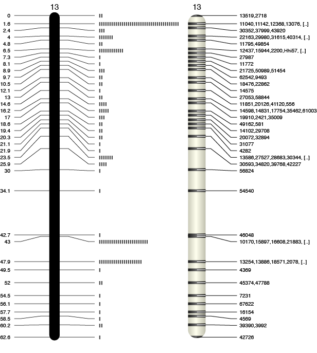

Genetic-mapper - Vectorial Genetic Map Drawer

[](https://travis-ci.org/pseudogene/genetic-mapper)

# Genetic-mapper

Genetic-mapper is a perl script able to draw publication-ready vectorial genetic maps.

## Description

Perl script for creating a publication-ready vectorial genetic/linkage map in Scalable Vector Graphics (SVG) format. The resulting file can either be submitted for publication and edited with any vectorial drawing software like [Inkscape](https://inkscape.org/) and [Abobe Illustrator(R)](http://www.adobe.com/uk/products/illustrator.html).

The input file must be a text file with at least the marker name (ID), linkage group (LG) and the position (POS) separeted by tabulations. Additionally a logarithm of odds (LOD score) can be provided. Any extra parameter will be ignored.

```
map.tsv

ID<tab>LG<tab>POS<tab>LOD
13519  12     0       0.250840894
2718   12     1.0     0.250840893
11040  12     1.6     0.252843341
...
```

## How to cite Genetic-mapper

>**Genetic-Mapper: vectorial genetic map drawer**.
>Bekaert M.
>_F1000Research_. 2016, 5:1301 (poster).

[](http://dx.doi.org/10.7490/f1000research.1112266.1)

## Installation (optional)

You can directly use the script `script/genetic_mapper.pl` or install it in your system using:

```
git clone https://github.com/pseudogene/genetic-mapper.git
cd genetic-mapper
perl Makefile.pl
make
make test
sudo make install
```

## Usage

```
..:: Vectorial Genetic Map Drawer ::..

Usage: ./genetic_mapper.pl [options] --map=<map.tsv>

Options
 --map <genetic map file>
       The input file must be a text file with at least the marker name (ID), linkage
       group (LG) and the position (POS) separeted by tabulations. Additionally a
       logarithm of odds (LOD score) can be provided. Any extra parameter will be ignored.
         ID     LG    POS     LOD
         M19    12    0.01    0.45068
         M18    12    1.14    0.00014
         M40    12    11.48   0.25284
  --chr <string>
       Draw only the specified chromosome/linkage group.
  --delim <character>
       Use <character> as the field delimiter character instead of the tab character.
  --bar
       Use a coloured visualisation with a dark bar at the marker position.
  --plot
       Rather than a list of marker names, it plots a circle. If the LOD-score is provided
       a dark disk fills the circle proportionality to its value.
  --var
       If specified with --bar or --plot the size of the bar/circle is proportional to the
       number of markers.
  --col
       If --plot is specified and if more that one LOD-score column is available specify
       the column number [default 1 (first LOD-score column)].
  --square
       Small squares are used rather than names (incompatible with --plot).
  --pos
       The marker positions are indicated on the left site of the chromosome.
  --compact
       A more compact chromosome is used (incompatible with --bar).
  --karyotype=<karyotype.file>
       Specify a karytype to scale the physical chromosme. Rather than using genetic
       distances, expect nucleotide position in the map file.
        FORMAT: "chr - ID LABEL START END COMMENT"
  --scale= ]0,+oo[
       Change the scale of the figure [default x10].
  --horizontal
       Rotate the figure by 90 degrees.
  --verbose
       Become chatty.
```

## Examples

```
# compact (stylish)
./genetic_mapper.pl --var --compact --plot --map=map.tsv > lg.svg

# Classic publication style
./genetic_mapper.pl --pos --chr=13 --map=map.tsv > lg13.svg
```



## License
The content of this project itself is licensed under the [Creative Commons Attribution-ShareAlike 4.0 International License](http://creativecommons.org/licenses/by-sa/4.0/), and the source code presented is licensed under the [GPLv3 license](http://www.gnu.org/licenses/gpl-3.0.html).
